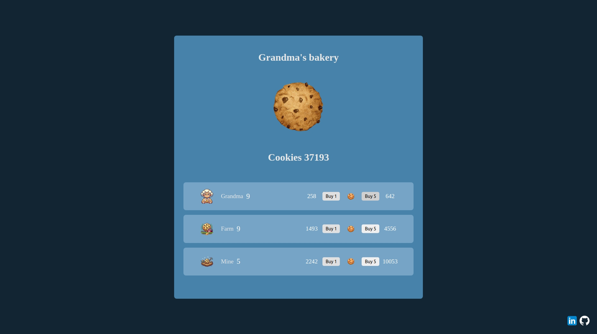

# Cookie Clicker Clone

  

🇺🇸 This project is a clone of the popular Cookie Clicker game, developed in TypeScript and JavaScript. The application allows users to click on a cookie to earn points and purchase upgrades that increase automatic cookie production.  
🇧🇷 Este projeto é um clone do popular jogo Cookie Clicker, desenvolvido em TypeScript e JavaScript. A aplicação permite aos usuários clicar em um cookie para ganhar pontos e comprar upgrades que aumentam a produção de cookies automaticamente.

- [English Version](#english-version)
- [Versão em Português](#versao-em-portugues)

---

# 🇧🇷 Versão em Português

## Tecnologias Utilizadas
- **TypeScript**: Linguagem de programação utilizada para implementar a lógica do jogo, garantindo maior segurança e escalabilidade.
- **JavaScript**: Utilizado para manipulação do DOM e interatividade.
- **HTML/CSS**: Estruturação e Estilização da página web.

## Funcionalidades Principais
### Gerenciamento de Entidades
- **Cookie**: O usuário pode clicar no cookie para ganhar pontos.
<<<<<<< HEAD
- **Upgrades**: Entidades como **Grandma, Farm** e **Mine** Produzem cookies automaticamente a cada segundo.
=======
- **Upgrades**: Entidades como **Grandma, Farm** e **Mine** produzem cookies automaticamente a cada segundo.
>>>>>>> 3f0430d87a46cf9a0550cc71c1dcb210e961fea5

### Operações de Jogo
- **Clique no Cookie**: O usuário pode clicar no cookie para ganhar pontos.
- **Comprar Upgrades**: O usuário pode comprar upgrades (Grandma, Farm, Mine) para aumentar a produção automática de cookies.
- **Salvar Progresso**: O progresso do jogo é salvo automaticamente no localStorage do navegador.
- **Carregar Progresso**: O usuário pode carregar o progresso salvo ao abrir o jogo novamente.

## Objetivos do Projeto
- **Aprender TypeScript**: Aplicar conceitos fundamentais de TypeScript em um projeto prático.
- **Desenvolver Lógica de Jogo**: Implementar funcionalidades de um jogo incremental de forma simplificada.

## Estrutura do Projeto
### Arquivo Principal (`index.ts`)
O arquivo principal contém a lógica do jogo, incluindo funções para salvar e carregar o progresso, atualizar a interface do usuário e gerenciar eventos de clique e compra de upgrades.

### Classe Entity (`Entity.ts`)
Esta classe gerencia os atributos e métodos relacionados às entidades do jogo (Cookie, Grandma, Farm, Mine). Ela contém métodos para comprar upgrades, calcular custos e atualizar a produção de cookies.

### Arquivo de Estilos (`index.css`)
O arquivo de estilos define a aparência da interface do usuário, incluindo a disposição dos elementos, animações e responsividade.

### Arquivo HTML (`index.html`)
O arquivo HTML estrutura a página web, incluindo elementos como o cookie clicável, contadores de pontos e botões de compra de upgrades.

<<<<<<< HEAD

## Referência
### https://orteil.dashnet.org/cookieclicker/
=======
## Referência
- [Cookie Clicker Jogo Original](https://orteil.dashnet.org/cookieclicker/)

[Voltar ao Topo](#top)

---

# 🇺🇸 English Version

## Technologies Used
- **TypeScript**: Programming language used to implement the game's logic, ensuring better safety and scalability.
- **JavaScript**: Used for DOM manipulation and interactivity.
- **HTML/CSS**: Webpage structuring and styling.

## Main Features
### Entity Management
- **Cookie**: Users can click on the cookie to earn points.
- **Upgrades**: Entities like **Grandma, Farm**, and **Mine** produce cookies automatically every second.

### Gameplay Operations
- **Click the Cookie**: Users can click on the cookie to earn points.
- **Buy Upgrades**: Users can buy upgrades (Grandma, Farm, Mine) to increase automatic cookie production.
- **Save Progress**: The game's progress is automatically saved in the browser's localStorage.
- **Load Progress**: Users can load their saved progress upon reopening the game.

## Project Goals
- **Learn TypeScript**: Apply fundamental TypeScript concepts in a practical project.
- **Develop Game Logic**: Implement incremental game functionalities in a simplified manner.

## Project Structure
### Main File (`index.ts`)
The main file contains the game's logic, including functions to save and load progress, update the user interface, and manage click and upgrade events.

### Entity Class (`Entity.ts`)
This class manages the attributes and methods related to the game's entities (Cookie, Grandma, Farm, Mine). It includes methods for purchasing upgrades, calculating costs, and updating cookie production.

### Style File (`index.css`)
The style file defines the appearance of the user interface, including layout, animations, and responsiveness.

### HTML File (`index.html`)
The HTML file structures the webpage, including elements like the clickable cookie, score counters, and upgrade purchase buttons.

## Reference
- [Cookie Clicker Original Game](https://orteil.dashnet.org/cookieclicker/)

[Back to Top](#top)
>>>>>>> 3f0430d87a46cf9a0550cc71c1dcb210e961fea5
